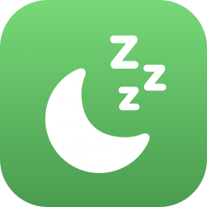

  
  <h1>Tab Tamer</h1>
  
<b>Aggressively snoozes inactive Chrome tabs to free memory — and goes further than Chrome's built-in Memory Saver.</b>

---

If you keep dozens of tabs open (or several Chrome profiles at once), Chrome can quietly eat **double-digit gigabytes** of RAM. Chrome's Memory Saver helps, but it's lazy and leaves extensions, recently-used tabs, and audio tabs fully loaded. Tab Tamer is a tiny, privacy-respecting extension that snoozes background tabs **on demand** and **on a tight timer**.

## Features

- **Snooze background tabs now** — one click (or `⌘⇧Y` / `Ctrl+Shift+Y`) instantly discards every background tab in the profile, reclaiming their memory immediately. Perfect right before you launch something heavy.
- **Auto-snooze** — discards tabs you haven't touched in *N* minutes (default 10 — much more aggressive than Memory Saver).
- **Safe by design** — uses Chrome's *native* tab discard, so snoozed tabs stay in your tab strip and reload instantly when clicked. No URL rewriting, no lost scroll/form state (the trick that got the old "Great Suspender" banned).
- **Never snoozes** the active tab, pinned tabs, or tabs playing audio.

## Privacy

Tab Tamer requests **only** the `storage` and `alarms` permissions — **not** the `tabs` permission. It can discard tabs but it **cannot read your URLs, page contents, or browsing history**. There are no network requests, no analytics, nothing leaves your machine.

## Install (load unpacked)

This isn't on the Chrome Web Store — install it directly:

1. Open `chrome://extensions`
2. Enable **Developer mode** (top-right)
3. Click **Load unpacked** and select this folder
4. (Optional) Pin it, and set/confirm the hotkey at `chrome://extensions/shortcuts`

> **Multiple profiles?** Extensions are sandboxed per Chrome profile, so repeat the steps in each profile you use. The biggest memory win is still to keep only the profiles you're actively using open.

## How it works

A tiny MV3 service worker runs a once-a-minute alarm. Each sweep (and each manual "snooze") calls `chrome.tabs.discard()` on every tab that is **not** active, pinned, audible, or already discarded — and, for the auto sweep, that hasn't been touched within your configured window (`tab.lastAccessed`). Discarding unloads the tab's renderer process (freeing its memory) while leaving the tab in place; Chrome reloads it automatically the next time you focus it.

## License

[MIT](LICENSE) © Luke Fairbanks
